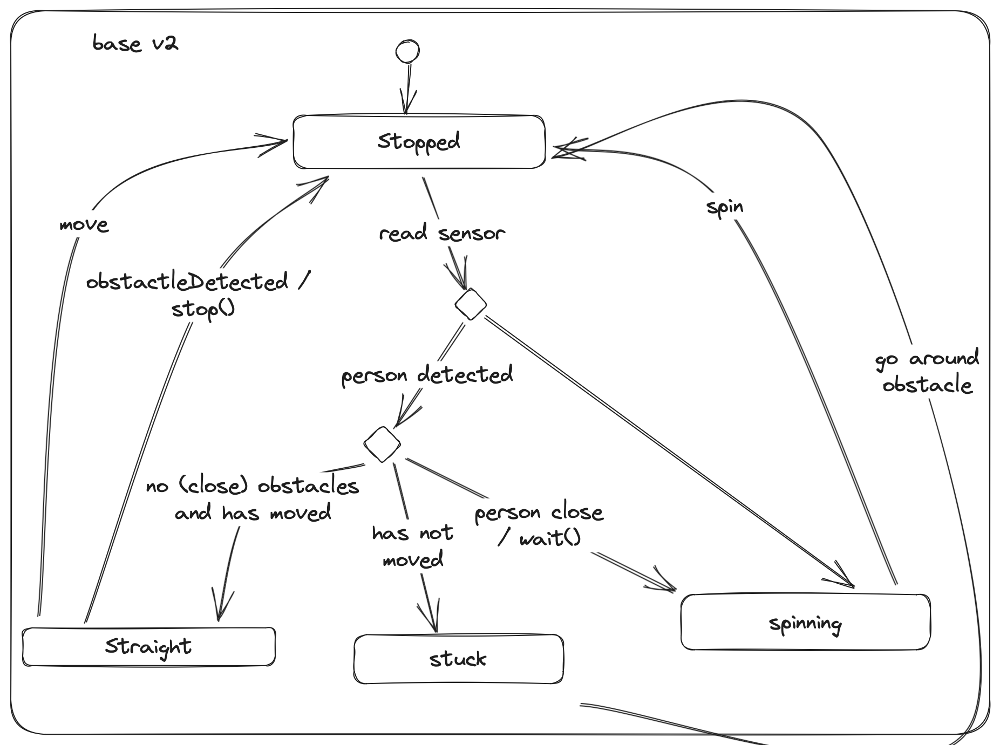

# Tipsy bot

Powered by [Viam](https://viam.com). Based on the [tutorial project](https://docs.viam.com/tutorials/projects/tipsy/).

## Getting started

This project assumes some knowledge of git, unix command line basics, [Homebrew](https://brew.sh), and [Python](https://www.python.org)

1. Clone this repo. I prefer the [`gh` CLI](https://cli.github.com): `gh repo clone hipsterbrown/tipsy && cd tipsy`

1. Install [`viam-server`](https://docs.viam.com/installation/#install-viam-server) manually, or run `brew bundle` in this directory

1. Install Python 3. I prefer [`rtx`](https://github.com/jdxcode/rtx#quickstart) as my tool version manager: `rtx install`

1. Install [viam-sdk](https://python.viam.dev) by running `python -m pip install -r requirements.txt`

1. Follow the SDK instructions for [creating a client application with Viam](https://python.viam.dev/#configure-a-client-application-at-app-viam-com), noting that viam-server is already installed

1. Copy the Viam app config from the app setup page: 

1. Rename `viam-example.json` to `viam.json` and paste app config in that file

1. Rename `.env.example` to `.env` and fill out the environment variables with the expected info, only the `ROBOT_SECRET` and `ROBOT_ADDRESS` are required if following the [tutorial project](https://docs.viam.com/tutorials/projects/tipsy/)

1. Run the Procfile tasks to start the viam-server and run the `tipsy.py` program (honcho is includd with the `pip install`): `honcho start`

## Expected functionality

- [X] Look for people, and move towards them using the camera and a machine learning model
- [X] Avoid bumping into obstacles using ultrasonic sensors.  This includes both not starting movement that will create a collision, but also stopping movement when something unexpectedly enters Tipsy’s path
- [X] Pauses near people to allow them to choose to grab drinks
- [X] Not get “stuck” next to the same person, mingle! (but don’t over-engineer it, randomness is OK, no need to track individual people or where Tipsy has been)
- [X] Attempt to not get stuck and/or tipping backwards when impacting an undetected object
- [X] Make the number of ultrasonic sensors configurable, e.g. allow one to have a config variable that says it should use X number of ultrasonic sensors

## Diagrams

_[How to read a statechart diagram](https://sceweb.uhcl.edu/helm/RationalUnifiedProcess/process/modguide/md_stadm.htm)_

### Base state machine

The ["base" movement module](https://python.viam.dev/autoapi/viam/components/base/index.html#viam.components.base.Base) controls the direction and distance of Tipsy. It consists of the `stopped`, `straight`, and `spinning` states used by the [reference program provided by Viam](https://github.com/viam-labs/devrel-demos/blob/main/tipsy-bot/tipsy.py).

### Base v2 state machine

This updated machine adds to original design by explicitly transitioning to the `stopped` state when an obstacle is encountered during the `straight` movement action to protect against multiple calls to `stop()` before the person detection loop kicks in again. If an object is detected before attempting to move forward, Tipsy will check if it's a person and wait for them to grab a drink before spinning and running the detection loop again. If Tipsy compares the previous obstacle distance data and finds it unchanged from the most recent reading, it will declare itself stuck and attempt to go around an unseen obstacle.
